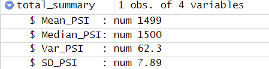
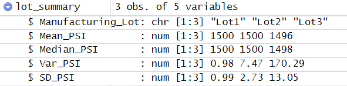

# MechaCar_Statistical_Analysis

## Linear Regression to Predict MPG

## Summary Statistics on Suspension Coils

The mean and median of each lot (lot1, lot2, lot3) are very similar and in some instances the same. This would suggest that graph would be normally distributed.

Based on total summary, the design specifications for the MechaCar suspension coils do meet standards, in which it does not exceed 100 pounds per square inch.

But based on each lot summary, lot 1 and lot 2 have less than 100 pounds as variance (0.98 and 7.47 respectively). While lot 3 would not meet design specification with a variance equal to 170.

